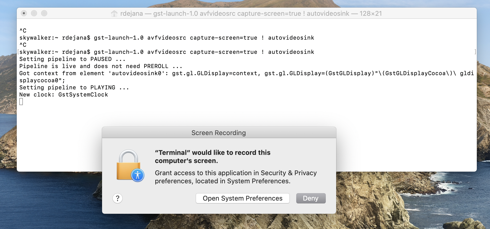
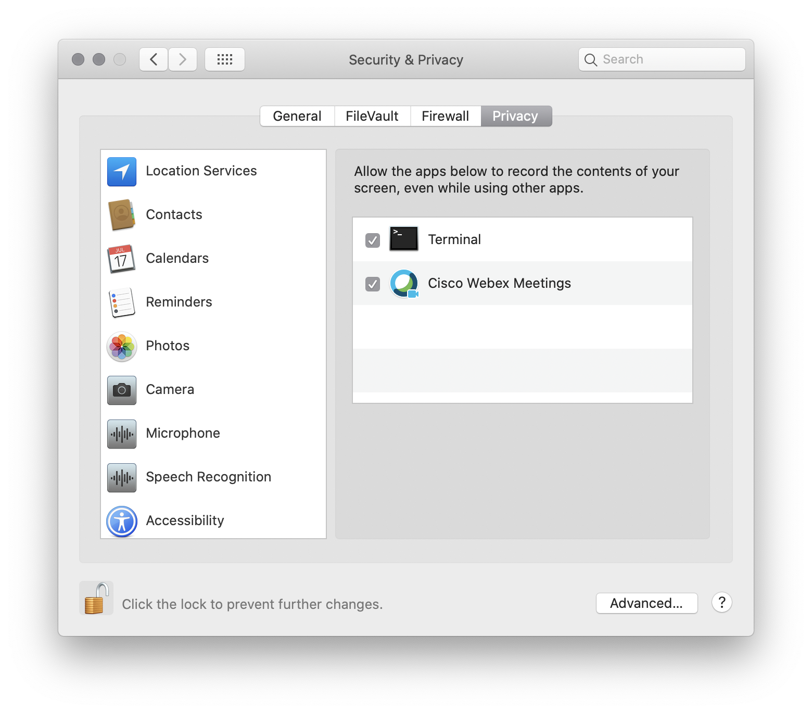

# GStreamer
GStreamer is a framework for creating streaming media applications and is part of the Nvidia's l4t distribution.  It may be used to capture and transform camera into or to stream video from the Jetson device.

This section will share some approaches to using GStreamer to stream content to and from your Jetson.  As with the X Windows section, the exmaples will cover macOS and Linux.

## MacOs
You'll be using Homebrew to install GStreamer.  As an alternative, you may following the intructions [here](https://gstreamer.freedesktop.org/documentation/installing/on-mac-osx.html?gi-language=c).

### Installing Homebrew
If Homebrew is not installed, follow the instructions on the [Homebrew website](https://brew.sh)

### Installing GStreamer with brew
Once Homebrew is installed, running the following command in a terminal to install GStreamer `brew install gstreamer gst-plugins-base gst-plugins-good gst-plugins-bad gst-plugins-ugly gst-libav`.

### Verification examples
The following examples may be used to verify that GStream is running correctly.
#### Stream Desktop
This example will stream you desktop to a window running locally.
In a terminal, run the command: `gst-launch-1.0 avfvideosrc capture-screen=true ! autovideosink`

Note, you may You may be asked to grant permission.  Grant it.

You'll need to quit and run the command again.  This time you should see something similar to:

